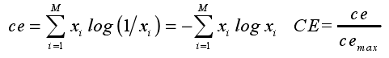
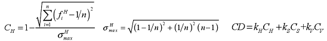

#本分支代码主要包含五部分

 
## 一、图像分割评估
   - **1. 白底图评估**
     - 采用cv2.findContours()函数,先设定阈值，然后将白底图转为二值得黑白图，通过边缘检测的方法，确定轮廓
     - 执行方法
        - cd `cd seg_evaluation/`
          将图片放入`./picture`文件夹中
        - `python findPostion.py`
          计算结果保存在 `white_result.json`中
   - **2. 场景图评估**
      - 采用MaskSorcing rcnn在coco2017上的预训练结果测试现有商品数据集，通过目标掩膜（mask）的最小外接矩形的中心和倾斜度来评估商品的居中程度和倾斜度
      - 以下为在5510张场景图上的测试结果
      
         - 置信度阈值|漏检数量|正确率   
            --|--|--
            0.1|200|96.37%
      

      - 在AIPower上的执行方法
         - 进入对应目录   
           `cd ../volume/yfj_workspace/maskscoring_rcnn-master/`   
           将图片放入目录下的`/picture`文件夹
         - 激活conda虚拟环境   
           `export PATH="/volume/miniconda3/bin:$PATH"`   
           `source activate maskrcnn_benchmark`
         - 执行文件   
         `python demo/compute_result.py`  
         居中程度和倾斜程度的计算结果保存在`result.json`中，检测成功的结果和数据库中未能检测出来的样本保存在相应的文件夹中，详见`compute_result.py`中的代码注释

      - 测试mask scoring rcnn原始代码
         - 进入目录`cd ../volume/yfj_workspace/maskscoring_rcnn-master/`
         - 将要测试图片命名为`test.jpg`
         执行`python demo/demo.py`
         生成结果为`result.png`
      
      - 模型存放地址   
         - 第一个模型为在coco2017上训练90000轮的mask scoring rcnn，主干网络为ResNet-101   
      `/volume/yfj_workspace/maskscoring_rcnn-master/models/model_0090000.pth`
         - 第二个模型为在coco2014上训练180000轮的mask rcnn，主干网络为ResXNet-101   
      `/volume/yfj_workspace/maskscoring_rcnn-master/models/e2e_mask_rcnn_X_101_32x8d_FPN_1x.pth`   
         - 切换模型需要在`demo/compute_result.py`处备注注明的地方更改参数，详见代码

      - 对mask scoring rcnn中源码的改动
         - 新增 `demo\compute_result.py` 文件
         - 在 `demo\predictor` 文件中新增函数 `run_on_imageList`（255行）和`select_the_connected_mask`（350行），具体改动详见代码说明。
      
      - 测试数据集存放地址
        - 场景图数据集存放地址：`/volume/yfj_workspace/maskscoring_rcnn-master/changjing`，共5510张
        - 类目数据集（几乎为白底图，含少量场景图）存放地址：`/volume/yfj_workspace/maskscoring_rcnn-master/item`，共6991张
     

## 二、场景图规则判断
- **1. 评估图像的清晰度：** 
   - 采用能量梯度函数（Energy）算法，公式如下：
  
同时提供Brenner梯度函数、Laplacian梯度函数、SMD(灰度方差)、SMD2(灰度方差乘积）等方法。  
   - 执行方法：  
      - `cd /picture_evaluation`   
        将图片放入 `/picture`文件夹  
      - `python clarity_assessment.py`  
 
- **2. 去除（检测）场景图的白边：** 
   - 通过设定图像边缘像素和的阈值寻找白边起始位置
   - 执行方法： 
      - `cd /picture_evaluation`  
        将图片放入 `/picture`文件夹
      - `python whitebar_detect.py

## 三、图像复杂度评估
   - **1. 判定图片背景复杂度**
      - 采用计算图像背景量化HSV的颜色熵来评估背景的复杂度，公式如下：  
        
      - 执行方法
         - `cd /picture_evaluation`  
           将图片放入`/picture`中
           将图片对应的mask图片放入`/mask`中
         - `python color_entropy.py`
     
   - **2. 判定图片颜色复杂度**
      -  计算图像背景的颜色分布均匀度，分别图像H，S，V三通道下的直方图分布方差的补来衡量图像颜色信息的分布，公式如下：  
      
      - 执行方法
         - `cd /picture_evaluation`  
           将图片放入`/picture`中
           将图片对应的mask图片放入`/mask`中
         - `python color_metric.py`  
         
   - **3. 判定图片颜色堆叠程度**
      - 颜色堆叠表现为不同颜色交错分布，因此子区域的颜色复杂度高。暂时想到的办法是提取图像的前景后，将前景划分为若干小块，分别评估每块的颜色复杂度后计算平均值。
      - 执行方法
         - `cd /picture_evaluation`  
           将图片放入`/picture`中
           将图片对应的mask图片放入`/mask`中
         - `python split_pictrure_operation.py`
    
   - **4. 整体流程**
      - 对输入图片进行整体评估，先评估清晰度，然后判断是否有白边，如果有的话剔除白边，然后依次计算图片的背景的整洁度，颜色复杂度以及前景的颜色堆叠程度
      - 执行方法
         - `cd /picture_evaluation`  
           将图片放入`/picture`中
           将图片对应的mask图片放入`/mask`中
         - `python operation.py`
         - 计算结果保存在`result.json`中
    
   - **5.测试数据集在AI Power服务器中存放地址**
      - 说明：测试数据为已经完成前背景分离的场景图，目前仅包含电子和美妆两类产品
      数据存地址为：商品图：`volume/yfj_workspace/Color/prime`
      商品图对应的mask:`volume/yfj_workspace/Color/mask`

## 四、判断是否为拼图
- **1. 数据集准备**
    - 准备正样本(拼图)
      - 扩充数据
         - 数据增强：对商品数据集中的原有拼图进行增强扩充，增强方法包括：平移、翻转、颜色抖动、高斯噪声等
            - 执行方法: 
            - `cd /binary_classify/`
            - 将商品数据集中的原始拼图放在 `/samples` 文件夹中，商品数据集中原始拼图存放在AI Power服务器中的`/volume/yfj_workspace/torf/samples`路径
            - `python data_augmentation.py`
            - 图片增强的结果存放在`/sample_au`文件夹
      - 合成数据
         - 合成真拼图：合成不同拼接张数，不同缝隙颜色，不同缝隙宽度的不同拼图
            - 执行方法：
            - `cd /binary_classify/`
            - 将非拼图的图片放在 `./picture`文件夹中，非拼图数据集存放在AI Power服务器中的`/volume/yfj_workspace/torf/picture`路径
            - `python generate_pintu.py`
            - 合成的图片存放在`./randomresult`中
         - 合成假拼图：在非拼图上划线
            - 执行方法：
            - `cd /binary_classify/`
            - 将非拼图的图片放在 `./picture`文件夹中，非拼图数据集存放在AI Power服务器中的`/volume/yfj_workspace/torf/picture`路径
            - `python drawline.py`
            - 合成的图片存放在`./drawresult`中
      - 将两种方法合成的图片放入`./positive`中，已经合成好的数据集存放在AI Power服务器中的`/volume/yfj_workspace/torf/positive`
    - 随机挑选负样本（非拼图）
       - 执行方法：
         - `cd /binary_classify/`
         - 将非拼图的图片放在 `./picture`文件夹中，非拼图数据集存放在AI Power服务器中的`/volume/yfj_workspace/torf/picture`路径
         - `python randomselect.py`
         - 挑选的图片存放在`/negetive`文件夹，已经合成好的数据集存放在AI Power服务器中的`/volume/yfj_workspace/torf/negetive`路径
 
- **2. 训练**
   - 分别采用VGG16作为基干网络进行训练，利用ImageNet上的训练权重初始化网络，然后在拼图和非拼图的数据集上训练分类器和最后几层卷积层
   - 训练全连接层和分类器
      - 执行方法：
         - `cd /binary_classify/`
         - `python vgg16-withpooling.py`
         - 训练模型保存最大验证集准确率和最小验证集loss的模型，同时每隔50个epoch保存一次模型，所有模型保存在`./record`中
         - 训练的tensorboard记录存放在`./log1`目录中
   - 训练解冻的卷积层
      - 执行方法：
         - 修改`vgg16-withpooling-continue.py`中的模型地址，选择`./record`文件夹中选择合适的权重文件载入
         - `python vgg16-withpooling-continue/py`
         - 训练模型保存最大验证集准确率和最小验证集loss的模型，同时每隔50个epoch保存一次模型，所有模型保存在`./record`中
         - 训练的tensorboard记录存放在`./log2`目录中
 
- **3.测试**
    - `cd /binary_classify/record`
    - 将测试集的正样本放入`/ptest`文件夹，负样本放入`/ntest`文件夹   
    已有的正负样本存放在`/volume/yfj_workspace/torf/record/ptest`和`/volume/yfj_workspace/torf/record/ntest`
    
    - 执行方法
       - 修改`prediction_unit.py`中的模型地址，选择本目录及子目录下合适的权重文件载入
       - `python prediction_unit.py`
       - 测试结果保存在目录下`result.txt`中
       - 分类正确和错误的样本分别存放在相应的文件夹下，详细信息见代码注释

## 五、web应用使用方法
- *说明*
  *使用技术栈：flask+gunicorn+supervisor"*
  *已部署功能：1、白底图的分割评估功能 2、场景图的规则判断 3、场景图的复杂度评估*
  *未部署功能：场景图的分割评估，因服务器环境不一致，尚未部署*
  **使用方法**
   - 1.测试单张白底图分割效果
      - `cd /webapp`
      - 将图片放入此目录下，重命名为`test.jpg`
      - `python request2.py`
   - 2.测试单张场景图规则及复杂度评估
      - `cd /webapp`
      - 将场景图及图片相应的mask图片放入此目录，场景图命名为`picture.jpg`,mask图片命名为`mask.jpg`
      - `python request.py`
